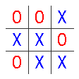
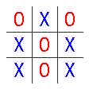
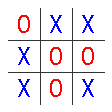

# Tic Tac Toe All The Numbers

----

Table of contents

 * [Inspiration](#inspiration)
 * [Issues with the Kaggle Dataset](#issues-with-the-kaggle-dataset)
 * [Definitions](#definitions)
 * [Main Math Reference](#main-math-reference)
 * [Math](#math)
 * [References](#references)

## Inspiration

Inspired by the [Kaggle Tic-Tac-Toe End game Dataset](https://www.kaggle.com/datasets/aungpyaeap/tictactoe-endgame-dataset-uci).

That Dataset is a 46KB CSV file with 958 rows plus 1 header (959 lines total).
Each row is 10 columns - the 3x3 board plus 1 outcome ("positive" or "negative").

The Dataset self-describes itself as "All possible board configurations at the
end of tic-tac-toe game".
The Dataset information says "About 65.3% are positive (wins for X)",
and that "X is assumed to have played first".

The Dataset was created in 1991 by David W. Aha.
The Dataset is also discussed at [UCI Machine Learning Repository Tic-Tac-Toe Endgame Data Set].


## Issues with the Kaggle Dataset

 * No information provided on how the 958 "endgames" were generated.
 * No independent verification of "958" can be found.
 * Specifically, what about pure duplicates?  i.e. it is known that 
   the same endgame state can
   be generated by multiple games: are these counted?
 * Specifically, many games are symmetrical to one another: are all of 
   these counted?
 * Given the unknowns in the counting, the "65.3% are positive" assertion
   is suspect - 65% is just the number of times "positive" appears in the 
   Dataset (626), divided by the total number of lines (958).  In general,
   this is a good lesson in the dangers of percentages when either the
   numerator or denominator is not well-defined or understood.
 * It is silly to loose information about the outcomes - "O" winning and 
   "Draw" both have been given the "negative" label.  
    Given up-to-date tools, it is easy to transform
   "X wins", "O wins" and "Draw" into "positive" and "negative" if that is
   what your use requires.
  

## Definitions

<dl>
  <dt>Turn</dt>       <dd>the act of placing an 'X' or 'O' in an empty cell</dd>
  <dt>Game</dt>       <dd>a series of turns that end in a win, loss or draw</dd>
  <dt>Board State</dt><dd>the state of the board after 0 to 9 turns</dd>
  <dt>Game State</dt> <dd>the state of the board after a Game</d d>
</dl>

## Main Math Reference 

Paper by [Zayd Muhammad Kawakibi Zuhri]

This paper does a fantastic job laying out most of the numbers around 
Tic Tac Toe.  In particular, it provides a double-check on the brute-force
computations below.

## Math

### 255168 Games

Item               | Count   | Percentage
----               |  ----   | ----
Total Games X wins |  131184 |   51% 
Total Games O wins |   77904 |   31% 
Total Games Draws  |   46080 |   18% 
Total Games        |  255168 |  100% 

### 138 fully unique Game States

Item | Expression | Count | Comment
---- | ----       |  ---- |  ---- 
(wrong) Number of Games | 9! |  362880  | naive, overcounts because of "stops"
(correct) Number of Games | | 255168   | see references
(wrong) maximum Game States | 3^9 | 19683 | naive - X,O,blank states for 9 cells
Final Game States   | |  958  |    "reachable", but contains symmetry dupes
Final Game States   | |  138  |    "reachable" and no symmetry dupes


### Percent given 958 Game States

(Note: this analysis is faulty since games are played by turns, not by
 picking a board state at random.)

Item                             | Count | Percentage
----                             |  ---- | ----
Total Unique Board States X wins | 626   |  65.34%
Total Unique Board States O wins | 316   |  32.98%
Total Unique Board States Draw   |  16   |  1.67%
Total Games                      | 958   |  100%

### Percent given 138 Game States

(Note: as above, this analysis is faulty since games are played by turns, not by
 picking a board state at random.)

Item                             | Count | Percentage
----                             |  ---- | ----
Total Unique Board States X wins |  91   | 65.94%
Total Unique Board States O wins |  44   | 31.88%
Total Unique Board States Draw   |   3   |  2.17%
Total Games                      | 138   | 100%


### Final Board States - Unique - Draw






## Python

```
$ cd ~/pythonenvs
$ python3 -m venv py3ttt
$ . ./py3ttt/bin/activate
$ cd ~/workspace/tictactoe/src/main/python
(py3ttt) $ pip install -r requirements.txt
(py3ttt) $ echo "Note that jupyterlab is the 'next generation' of notebook"
(py3ttt) $ jupyter lab --ip=0.0.0.0
```

### References

   1. [Kaggle Tic-Tac-Toe End game Dataset]
   2. [Zayd Muhammad Kawakibi Zuhri]
   3. [Wikipedia]


[Kaggle Tic-Tac-Toe End game Dataset]:https://www.kaggle.com/datasets/aungpyaeap/tictactoe-endgame-dataset-uci
[Zayd Muhammad Kawakibi Zuhri]:https://informatika.stei.itb.ac.id/~rinaldi.munir/Matdis/2021-2022/Makalah2021/Makalah-Matdis-2021%20(148).pdf
[Wikipedia]:https://en.wikipedia.org/wiki/Tic-tac-toe
[UCI Machine Learning Repository Tic-Tac-Toe Endgame Data Set]:https://archive.ics.uci.edu/ml/datasets/tic-tac-toe+Endgame

[ooxxxooxx]:https:src/images/ooxxxooxx.png
[oxoxoxxox]:https:src/images/oxoxoxxox.png
[oxxxooxox]:https:src/images/oxxxooxox.png


